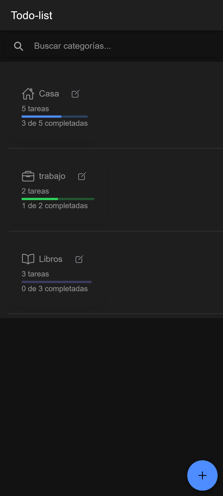
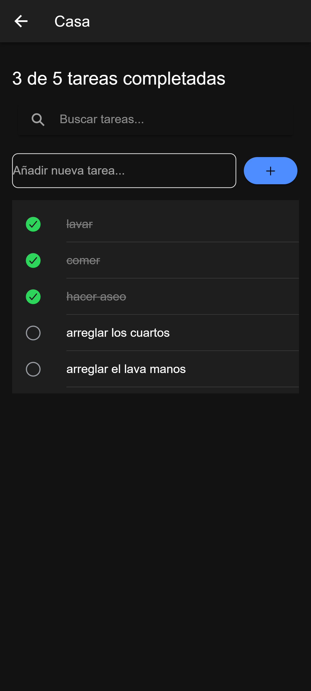
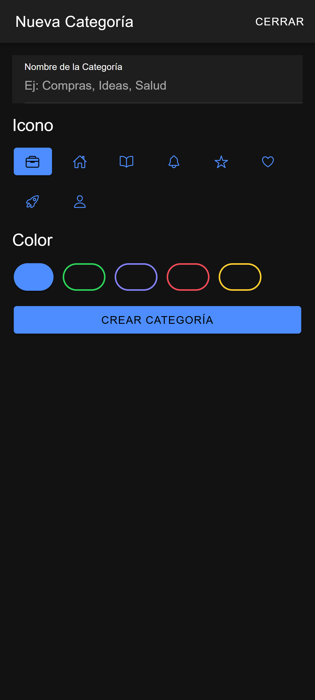
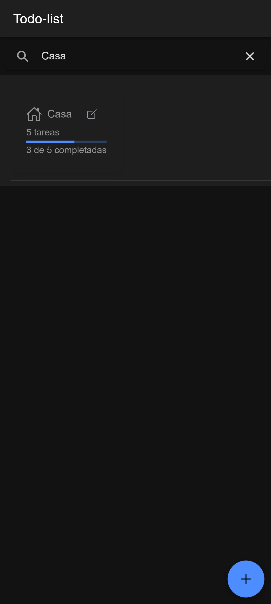
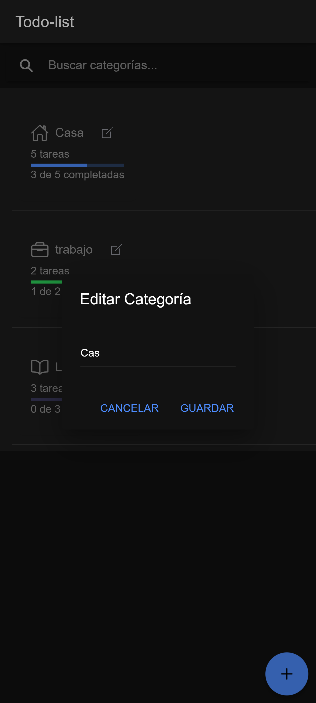
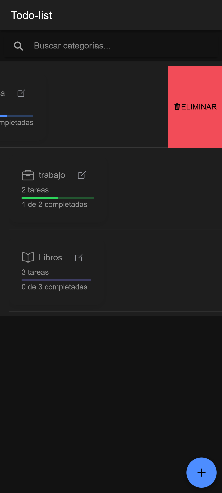
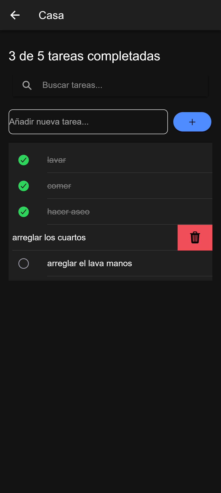
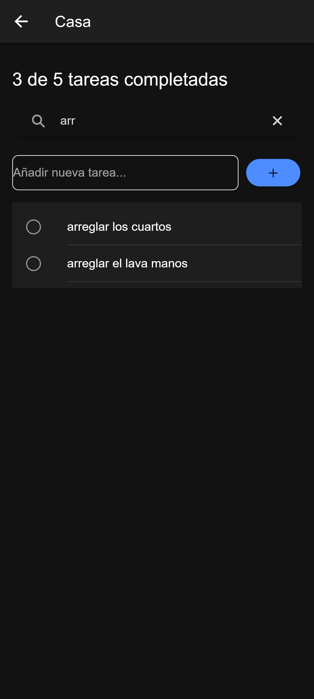

# 📝 To-Do List App (Ionic + Angular + Clean Architecture)

Aplicación de lista de tareas categorizadas desarrollada con **Ionic + Angular**, siguiendo principios de **Arquitectura Limpia (Clean Architecture)**.  
Permite gestionar tareas, agruparlas por categorías, medir progreso, activar/desactivar funcionalidades mediante **Firebase Remote Config** y garantizar mantenibilidad con **tests unitarios (80% cobertura global)**.

---

## 📌 Características principales

✅ **Arquitectura Limpia**: separación en capas `domain`, `application`, `infrastructure` y `presentation`.  

✅ **CRUD de Categorías**: crear, editar, eliminar y personalizar con color e ícono.  

✅ **CRUD de Tareas**: añadir, completar, desmarcar y eliminar tareas dentro de cada categoría.  

✅ **Progreso visual**: barra que muestra el avance de tareas completadas por categoría.  

✅ **Búsqueda**:  
- Filtro de categorías en la pantalla principal.  
- Filtro de tareas dentro de cada categoría.  

✅ **Firebase Remote Config**: control de funcionalidades mediante feature flags.  

✅ **Almacenamiento local** con `@ionic/storage-angular`.  

✅ **Unit tests** con **Jasmine + Karma** y cobertura global superior al **80%**.  

---

## 📂 Estructura del proyecto

```
src/
 ├── app/
 │   ├── core/
 │   │   ├── domain/         # Entidades y repositorios (contratos)
 │   │   ├── application/    # Casos de uso (use cases)
 │   │   ├── infrastructure/ # Implementaciones (Storage, Firebase, etc.)
 │   │   └── presentation/   # Páginas, componentes y constantes
 │   ├── components/         # UI reutilizable (category-card, search-bar, etc.)
 │   ├── pages/              # Páginas (home, category-detail)
 │   └── constants/          # Constantes globales
 └── environments/           # Configuración (Firebase, etc.)
```

---

## ⚙️ Instalación y ejecución

Clonar repositorio:

```bash
git clone https://github.com/imartinezaguas/todo-list-ionic.git
cd todo-list-ionic
```

Instalar dependencias:

```bash
npm install
```

Ejecutar en navegador:

```bash
ionic serve
```

---

## 📱 Compilación para Android e iOS

### Android
```bash
ionic build --prod
ionic cordova platform add android
ionic cordova build android --release
```

👉 Abrir en **Android Studio** para generar el `.apk`.

📥 Descarga aquí el `.apk`:  
[➡️ Descargar APK](https://drive.google.com/file/d/1PIIex4Wc7Z79XSWF2tbfMBFoogEYsprB/view?usp=sharing)

---

### iOS
```bash
ionic build --prod
ionic cordova platform add ios
ionic cordova build ios
```

👉 Abrir en **Xcode** (`platforms/ios`) y generar el `.ipa`.

---

## 🔥 Configuración de Firebase Remote Config

1. Crear un proyecto en **Firebase Console**.  
2. Agregar una app Web y copiar la configuración en `src/environments/environment.ts`.  
3. Habilitar **Remote Config** y crear parámetros:  

   - `ENABLE_SEARCH_BAR`  
   - `ENABLE_ADD_TASK`  

Valores: `true / false`.  

👉 En la app, el `SearchBarComponent` y el `buttonTaskEnable` se renderizan solo si el flag está habilitado.

---

## ✅ Unit Tests & Coverage

Ejecutar pruebas unitarias:

```bash
ng test --code-coverage
```

Abrir reporte de cobertura:

```bash
npx http-server ./coverage/todo-list-ionic -o
```

📊 **Cobertura actual**:  
- Global: **80%+**  
- Application: casos de uso de categorías y tareas cubiertos.  
- Infrastructure: repositorios `StorageCategoryRepository` y `StorageTaskRepository` cubiertos.  
- Presentation: tests de componentes clave (`HomePage`, `CategoryDetailPage`).  

---

## 🚀 Optimización de rendimiento

- **Lazy Loading** en rutas (`loadChildren`).  
- `ChangeDetectionStrategy.OnPush` en componentes de presentación.  
- `trackBy` en `*ngFor` de categorías y tareas para evitar renders innecesarios.  
- **Storage eficiente** con actualizaciones incrementales.  

---

## 📸 Capturas

### Home con categorías


### Vista de detalle con tareas


### Crear nueva categoría


### Barra de progreso completada


### Editar categoría


### Eliminar categoría


### Eliminar tarea


## Buscar tareas


---

## ❓ Preguntas solicitadas

### 1. Principales desafíos
- Sincronizar en tiempo real el progreso de categorías al marcar/desmarcar tareas.  
- Integración de `@ionic/storage-angular` para persistencia de datos.  
- Configurar **Remote Config** con feature flags.  
- Diseñar arquitectura limpia y mantener separadas las responsabilidades.  

### 2. Optimizaciones aplicadas
- `trackBy` en listados para mejorar performance.  
- `OnPush` en componentes que solo dependen de inputs.
- Lazyload carga perezosa en las rutas.  
- Uso de constantes centralizadas para evitar hardcode y facilitar mantenimiento.  
- Tests unitarios que validan la lógica de casos de uso y repositorios.  

### 3. Calidad y mantenibilidad
- Arquitectura modular (**Clean Architecture**).  
- Uso de **constantes** para íconos, colores, y textos.  
- Tipado fuerte en **TypeScript** con interfaces.  
- Cobertura global de **80%+ en unit tests**.  

---

## 📦 Entregables

- Código fuente en este repositorio.  
- Capturas y/o video mostrando funcionalidades.  
- Archivos **APK** 
---

✍️ Desarrollado como prueba técnica en Ionic + Angular con **Clean Architecture** y **unit tests (80% cobertura)**.  
